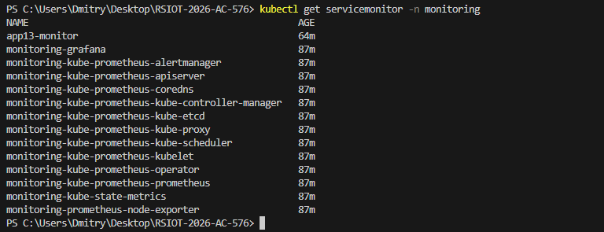
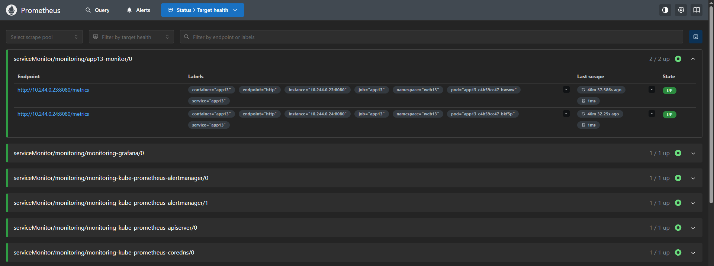
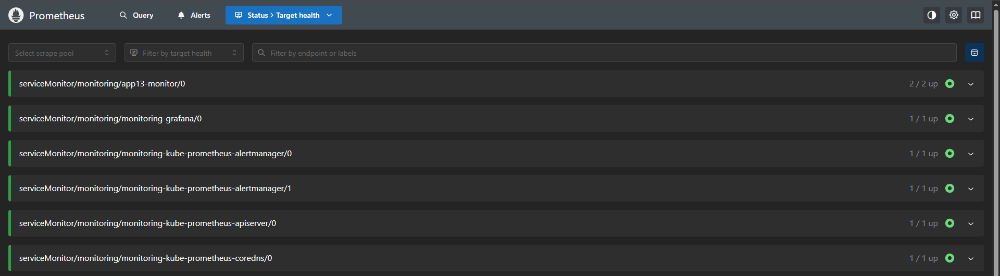
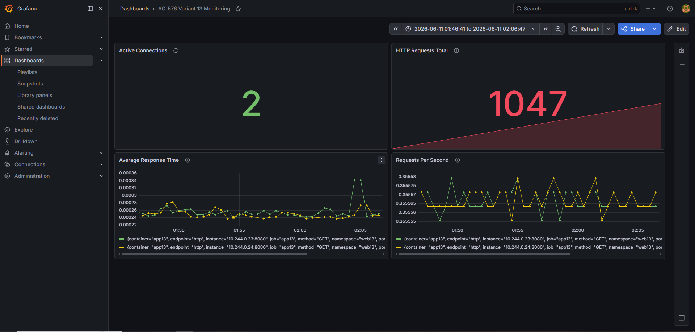

# Лабораторная работа №4

## Мониторинг Kubernetes-приложения с использованием Prometheus и Grafana

### Выполнил

Студент группы АС-576

Вариант: 13

ID: 220239

---

# Цель работы

Изучить возможности мониторинга приложений в Kubernetes с использованием Prometheus и Grafana. Настроить сбор пользовательских метрик приложения через ServiceMonitor и визуализировать их в Grafana.

---

# Исходные данные

Приложение было развернуто в пространстве имен `web13`.

В приложении реализованы пользовательские метрики:

* web13_http_requests_total
* web13_http_request_duration_seconds
* web13_active_connections

Для мониторинга использовался стек:

* Prometheus
* Grafana
* kube-prometheus-stack
* ServiceMonitor

---

# Установка системы мониторинга

Для установки использовался Helm.

Добавление репозитория:

```bash
helm repo add prometheus-community https://prometheus-community.github.io/helm-charts
helm repo update
```

Установка kube-prometheus-stack:

```bash
helm install monitoring prometheus-community/kube-prometheus-stack -n monitoring --create-namespace
```

Проверка развернутых компонентов:

```bash
kubectl get pods -n monitoring
```

Результат:

```text
alertmanager-monitoring-kube-prometheus-alertmanager-0 Running
monitoring-grafana Running
monitoring-kube-prometheus-operator Running
monitoring-kube-state-metrics Running
monitoring-prometheus-node-exporter Running
prometheus-monitoring-kube-prometheus-prometheus-0 Running
```

# Создание ServiceMonitor

Был создан объект ServiceMonitor для сбора пользовательских метрик приложения.

Файл servicemonitor.yaml:

```yaml
apiVersion: monitoring.coreos.com/v1
kind: ServiceMonitor

metadata:
  name: app13-monitor
  namespace: monitoring

spec:
  selector:
    matchLabels:
      app: app13

  namespaceSelector:
    matchNames:
      - web13

  endpoints:
    - port: http
      path: /metrics
      interval: 15s
```

Применение конфигурации:

```bash
kubectl apply -f servicemonitor.yaml
```

Проверка:

```bash
kubectl get servicemonitor -n monitoring
```

Результат:

```text
NAME            AGE
app13-monitor   85s
```

### СКРИНШОТ 2 – СПИСОК SERVICEMONITOR



---

# Проверка пользовательских метрик

Для проверки работы экспортера были получены метрики приложения.

Команда:

```bash
Invoke-WebRequest http://localhost:8061/metrics
```

Фрагмент результата:

```text
web13_http_requests_total{method="GET",status="200"} 15

web13_http_request_duration_seconds_sum{method="GET"} 0.004189

web13_http_request_duration_seconds_count{method="GET"} 15

web13_active_connections 1
```

Полученные данные подтверждают успешную публикацию пользовательских метрик.

### СКРИНШОТ 3 – ВЫВОД /METRICS



---

# Проверка обнаружения цели Prometheus

После создания ServiceMonitor Prometheus автоматически обнаружил приложение.

Проверка выполнялась через интерфейс Prometheus:

Status → Target Health

Результат:

```text
serviceMonitor/monitoring/app13-monitor/0
State: UP

serviceMonitor/monitoring/app13-monitor/1
State: UP
```

Количество активных целей:

```text
2/2 UP
```

Это означает, что Prometheus успешно получает данные с обоих экземпляров приложения.

### СКРИНШОТ 4 – TARGET HEALTH



---

# Настройка Grafana

Для доступа использовался port-forward:

```bash
kubectl port-forward -n monitoring svc/monitoring-grafana 3000:80
```

Получение пароля администратора:

```bash
kubectl get secret -n monitoring monitoring-grafana -o jsonpath="{.data.admin-password}"
```

Авторизация:

```text
Логин: admin
Пароль: получен из Kubernetes Secret
```

---

# Создание дашборда

В Grafana был создан пользовательский Dashboard.

На дашборде размещены четыре панели.

---

## Панель 1. HTTP Requests Total

Метрика:

```promql
web13_http_requests_total
```

Отображает общее количество HTTP-запросов.

Текущее значение:

```text
1047
```

---

## Панель 2. Active Connections

Метрика:

```promql
sum(web13_active_connections)
```

Отображает количество активных соединений.

Текущее значение:

```text
2
```

---

## Панель 3. Average Response Time

Метрика:

```promql
rate(web13_http_request_duration_seconds_sum[1m])
/
rate(web13_http_request_duration_seconds_count[1m])
```

Отображает среднее время обработки запросов.

Среднее значение:

```text
0.00024–0.00034 сек
```

---

## Панель 4. Requests Per Second

Метрика:

```promql
rate(web13_http_requests_total[1m])
```

Отображает количество запросов в секунду.

Среднее значение:

```text
≈ 0.355 запросов/сек
```

---

### СКРИНШОТ 5 – ГОТОВЫЙ DASHBOARD GRAFANA


---

# Вывод

В ходе лабораторной работы была развернута система мониторинга на базе Prometheus и Grafana в Kubernetes-кластере.

Был установлен пакет kube-prometheus-stack, настроен ServiceMonitor для автоматического обнаружения приложения и организован сбор пользовательских метрик.

В Grafana создан пользовательский Dashboard, отображающий:

* общее количество запросов;
* количество активных соединений;
* среднее время ответа приложения;
* количество запросов в секунду.

Полученные результаты подтверждают корректную работу системы мониторинга и успешный сбор метрик приложения в Kubernetes.
